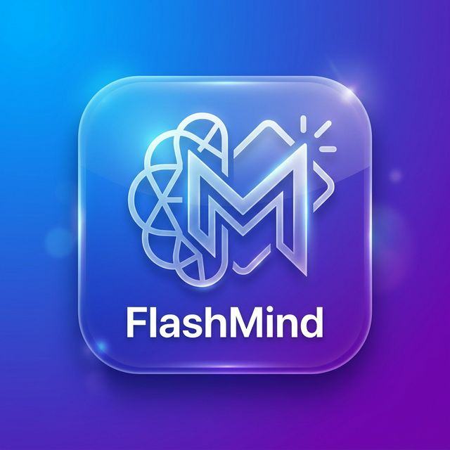
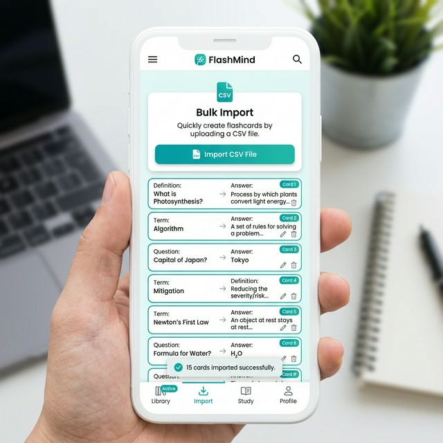
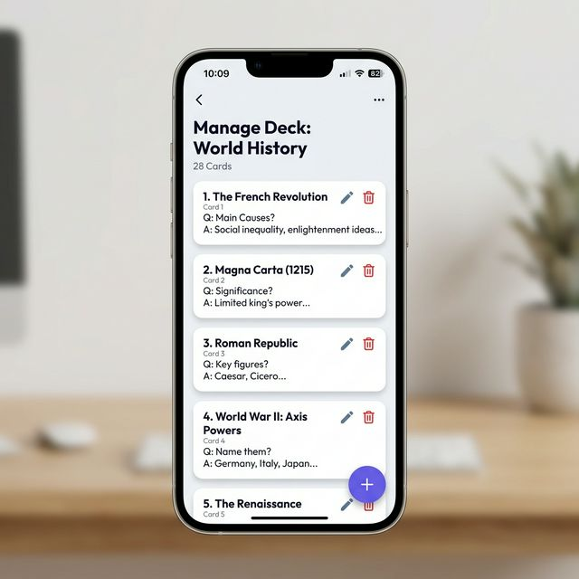

#  FlashMind — Learn Faster, Retain Longer

[](https://flutter.dev)
[](https://dart.dev)
[](https://pub.dev/packages/get)
[](https://github.com/shumailamustafa/CodeAlpha_-Flashcard-Quiz-App-)

FlashMind is a premium, high-fidelity flashcard application built with Flutter. Designed for learners who appreciate both speed and aesthetics, FlashMind combines the power of **GetX state management** with a stunning **3D-inspired sliding interaction** to make studying feel like a breeze.

---

## ✨ Key Features

- **🚀 Instant Study**: Slide through cards with fluid, horizontally snapping animations.
- **🔄 3D Flip**: Tap any card to reveal its answer with a realistic 3D perspective flip.
- **📂 Bulk Import**: Add entire decks in seconds using the CSV import feature.
- **📱 Mobile Optimized**: Intelligent layout and keyboard handling for a seamless experience on any device.
- **🎨 Premium UI**: Modern glassmorphism effects, gradients, and custom Outfit typography.

---

## 📸 App Mockups

| Home Screen (Study Mode) | Bulk CSV Import | Manage Deck |
| :---: | :---: | :---: |
|  |  |  |

---

## 🛠️ Technology Stack

FlashMind is built on a robust architecture to ensure performance and scalability.

- **Frontend**: Flutter & Dart
- **State Management**: GetX (MVVM Architecture)
- **Local Storage**: GetStorage (Lightweight Key-Value store)
- **Design System**: Vanilla CSS-like styling with Flutter Custom Decoration
- **Typography**: Google Fonts (Outfit)

---

## 🚀 Getting Started

### Prerequisites

- Flutter SDK (v3.11.1 or higher)
- Android Studio / VS Code with Flutter extension
- An Android/iOS Emulator or Physical Device

### Installation

1. **Clone the repository**:
   ```bash
   git clone https://github.com/shumailamustafa/CodeAlpha_-Flashcard-Quiz-App-.git
   cd CodeAlpha_-Flashcard-Quiz-App-
   ```

2. **Install dependencies**:
   ```bash
   flutter pub get
   ```

3. **Run the app**:
   ```bash
   flutter run
   ```

---

## 📥 CSV Import Guide

To bulk-add cards, use a CSV file with the following structure:

| Question | Answer |
| :--- | :--- |
| What is 2 + 2? | 4 |
| Capital of Japan? | Tokyo |

1. Go to **Manage Deck** via the settings icon.
2. Tap the **Upload** icon at the top right.
3. Select your `.csv` file.

---

## 📝 License

Distributed under the MIT License. See `LICENSE` for more information.

---

<p align="center">Made with ❤️ by Shumaila Mustafa</p>
